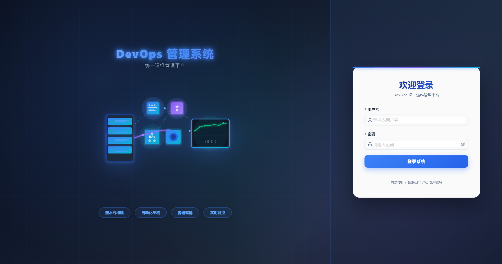

# DevOps 运维平台


DevOps 是一套开箱即用的企业级一站式 DevOps 平台，深度融合云原生生态，提供 Kubernetes 可视化运维、灵活可编排的 CI/CD 流水线、GitOps 发布与监控告警、日志追踪等全链路可观测能力。平台采用现代化技术架构，兼顾性能与扩展性，助力企业快速落地云原生研发运维体系，提升交付效率与运维稳定性。

## 登录界面



# 一、项目介绍

## 1.1 关于

DevOps 运维平台是一个企业级的一站式运维管理系统，围绕云原生基础设施和持续交付，提供完整的 DevOps 工具链。

把 Kubernetes 管理、CI/CD 流水线、GitOps 发布、监控告警拆分成清晰的功能模块，让运维工作既能保持高效性，也能维持长期可维护性。

| 模块 | 技术栈 | 定位 |
| --- | --- | --- |
| `server` | Go 1.25 / Gin / GORM / MySQL | 后端服务、认证、接口、数据与定时任务 |
| `web` | Vue 3 / Ant Design Vue / Element Plus / Vite | 运维管理、仪表盘、可视化、操作后台 |

**为什么选择 DevOps 运维平台**

- 有完整工程结构，而不是只做出一个页面展示
- 多集群管理与工作负载管理解耦，运维体验更纯粹
- 支持 Kubernetes、GitOps（ArgoCD）、监控告警等运维常见能力
- 适合企业级运维管理，也适合继续扩展成 PaaS 平台

## 1.2 核心功能

- **☸️ Kubernetes 管理**: 支持多集群管理、工作负载管理（Deployments, Pods, Services）、Web 终端和实时日志查看
- **🚀 CI/CD 流水线**: 自研可视化流水线（模板 + 制品管理）与 ArgoCD GitOps 结合，驱动构建与发布全流程
- **🤖 AI Copilot**: 智能 DevOps 助手，用于自动化故障排查、日志分析和运维指导
- **👀 可观测性与告警**: 集成 Prometheus/Grafana 监控，支持灵活的告警规则和 Telegram 通知
- **🛡️ 安全与 RBAC**: 细粒度的基于角色的访问控制（RBAC）、审计日志和安全资源管理
- **💰 成本管理**: 资源成本统计、预算管理和优化建议
- **🔒 合规检查**: 镜像扫描、配置合规检测和安全报告

## 1.3 技术栈

### 1.3.1 Server - 服务端

- **语言**: [Go 1.25](https://golang.org)
- **框架**: [Gin](https://github.com/gin-gonic/gin)
- **ORM**: [GORM](https://gorm.io)
- **数据库**: MySQL 8.0+
- **缓存**: Redis 6.0+
- **基础设施**: Kubernetes Client-go, OpenTelemetry
- **API 文档**: Swagger (Swaggo)

### 1.3.2 Web - 前端

- **框架**: [Vue 3](https://vuejs.org) + [Vite](https://vitejs.dev)
- **UI 组件**: [Ant Design Vue](https://antdv.com), [Element Plus](https://element-plus.org)
- **状态管理**: [Pinia](https://pinia.vuejs.org)
- **可视化**: ECharts, XTerm.js (Web 终端)
- **其他**: TypeScript, Vue Router, Axios, dayjs

## 1.4 目录结构

### 1.4.1 Server

```bash
server/
├── cmd/
│   └── server/             # 应用程序入口 (main.go)
├── internal/               # 私有应用程序代码
│   ├── config/             # 配置加载与 Gin 初始化
│   ├── domain/             # 领域模型与仓储接口
│   ├── models/             # 数据库模型定义
│   ├── modules/            # 业务逻辑模块 (Handlers & Repositories)
│   ├── service/            # 复杂业务服务层
│   └── infrastructure/     # 基础设施适配器 (K8s, DB, Cache)
├── migrations/             # 数据库 SQL 脚本
│   ├── init_tables.sql     # 全量建表（113 张表）
│   └── upgrades.sql        # 存量数据库升级补丁
├── pkg/                    # 公共库 (utils, errors, logger, response)
├── docs/                   # Swagger API 文档
└── go.mod
```

### 1.4.2 Web

```bash
web/
├── src/
│   ├── api/              # API 接口
│   ├── assets/           # 静态资源
│   ├── components/       # 公共组件
│   ├── router/           # 路由配置
│   ├── types/            # TypeScript 类型定义
│   ├── utils/            # 工具函数
│   ├── views/            # 页面组件
│   ├── App.vue           # 根组件
│   └── main.ts           # 入口文件
├── public/               # 公共文件
├── index.html            # HTML 模板
└── vite.config.ts        # Vite 配置
```

## 1.5 特性

### 1.5.1 API 文档

服务启动后，访问以下地址查看 API 文档：

```bash
http://localhost:8080/swagger/index.html
```

### 1.5.2 多集群管理

支持同时管理多个 Kubernetes 集群，统一视图查看所有集群资源状态。

### 1.5.3 Web 终端

内置 Web 终端，支持直接在浏览器中连接 Pod 执行命令，无需本地安装 kubectl。

# 二、环境要求

| 依赖       | 版本要求 | 说明                           |
| :--------- | :------- | :----------------------------- |
| Go         | >= 1.25  | 后端运行环境                   |
| Node.js    | >= 18    | 前端构建环境                   |
| MySQL      | >= 8.0   | 主数据库，需 utf8mb4 字符集    |
| Redis      | >= 6.0   | 缓存与会话存储                 |
| Kubernetes | >= 1.20  | 可选，完整功能需要运行中的集群 |

# 三、本地开发快速启动

## 3.1 环境要求

- **Node.js** >= 18 (web)
- **Go** >= 1.25 (server)
- **MySQL** >= 8.0 (server)
- **Redis** >= 6.0 (server)

> 如果本地没有安装部署 MySQL 和 Redis，可参考以下 docker 快速部署相关数据库（可选）。

创建 `mysql` 容器：

```bash
docker run -d --name devops-mysql \
  -p 3306:3306 \
  --privileged=true \
  -v /data/MySqlData:/var/lib/mysql \
  -e MYSQL_ROOT_PASSWORD="123456ok!" \
  -e MYSQL_DATABASE="devops" \
  -e TZ=Asia/Shanghai \
  mysql:8.0.34 \
  --character-set-server=utf8mb4 \
  --collation-server=utf8mb4_unicode_ci
```

创建 `redis` 容器：

```bash
docker run -d --name devops-redis \
  -p 6379:6379 \
  -v /data/redisData:/data \
  -e REDIS_PASSWORD=123456 \
  -e TZ=Asia/Shanghai \
  redis:7-alpine \
  redis-server --requirepass 123456 --appendonly yes
```

查看是否创建成功：

```bash
[root@docker-server ~]# docker ps
CONTAINER ID   IMAGE          COMMAND                  CREATED          STATUS          PORTS                                         NAMES
22205f8e78c6   mysql:8.0.34      "docker-entrypoint.s…"   34 minutes ago   Up 34 minutes   0.0.0.0:3306->3306/tcp, [::]:3306->3306/tcp   devops-mysql
33316g9f89d7   redis:7-alpine "docker-entrypoint.s…"   34 minutes ago   Up 34 minutes   0.0.0.0:6379->6379/tcp, [::]:6379->6379/tcp   devops-redis
```

## 3.2 克隆项目

```bash
git clone https://github.com/zyx3721/JeriDevOps.git /data/devops
cd /data/devops
```

## 3.3 数据库配置

### 3.3.1 本地数据库创建

创建 MySQL 数据库：

```bash
mysql -h 127.0.0.1 -u root -p -e "CREATE DATABASE IF NOT EXISTS devops DEFAULT CHARACTER SET utf8mb4 COLLATE utf8mb4_unicode_ci;"
```

### 3.3.2 容器数据库创建

进入容器内的 mysql 交互界面：

```bash
docker exec -it devops-mysql mysql -u root -p
```

在 mysql 中创建 devops 库（执行后输入 `exit` 退出）：

```bash
CREATE DATABASE IF NOT EXISTS devops DEFAULT CHARACTER SET utf8mb4 COLLATE utf8mb4_unicode_ci;
```

### 3.3.3 初始化数据库

**全新部署**：

```bash
# 初始化所有表结构和初始数据（113 张表）
mysql -h 127.0.0.1 -u root -p devops < migrations/init_tables.sql
```

初始化完成后使用以下账号登录：

| 字段 | 值 |
|------|----|
| 用户名 | `admin` |
| 密码 | `admin123` |
| 角色 | 超级管理员 |

**升级已有数据库**（全新部署无需执行）：

```bash
mysql -h 127.0.0.1 -u root -p devops < migrations/upgrades.sql
```

详细说明见 [migrations/README.md](migrations/README.md) 。

## 3.4 后端配置与启动

> 如果没有配置 go 的镜像代理，可以参考 [Go 国内加速：Go 国内加速镜像 | Go 技术论坛](https://learnku.com/go/wikis/38122)。

1. 下载相关依赖：

```bash
go mod download
```

2. 配置环境变量：

```bash
# 步骤1：复制模板文件
cp .env.example .env

# 步骤2：编辑 .env，配置数据库连接等信息
vim .env
```

`.env` 配置示例：

```bash
# 服务器配置
PORT=8080
LOG_LEVEL=info

# 数据库配置
MYSQL_HOST=localhost
MYSQL_PORT=3306
MYSQL_USER=root
MYSQL_PASSWORD=your_database_password
MYSQL_DATABASE=devops

# Redis 配置
REDIS_ADDR=localhost:6379
REDIS_PASSWORD=
REDIS_DB=0

# JWT 配置
JWT_SECRET=your_jwt_secret_key
JWT_EXPIRATION=24
```

3. 运行后端服务：

```bash
# 方式1：前台运行（终端关闭则服务停止）
go run cmd/server/main.go

# 方式2：后台运行（日志输出到 app.log）
nohup go run cmd/server/main.go > app.log 2>&1 &
```

后端服务默认运行在 `http://localhost:8080`，如需指定端口，请修改环境变量文件内的 `PORT` 参数。

## 3.5 前端配置与启动

1. 进入前端目录下载相关依赖：

```bash
cd web
npm install
```

2. 配置 API 地址（可选）：

```bash
# 配置说明：
# - 后端端口 = 8080：无需创建 .env 文件（默认值为 http://localhost:8080）
# - 后端端口 ≠ 8080：需要创建 .env 文件（指定正确端口，例如后端端口改为 8090）
#   创建 .env 文件，例如：
echo "VITE_DEV_PROXY_TARGET=http://localhost:8090" > .env
```

3. 启动前端服务：

```bash
# 方式1：前台运行（终端关闭则服务停止）
npm run dev

# 方式2：后台运行（日志输出到 web.log）
nohup npm run dev > web.log 2>&1 &
```

前端服务默认运行在 `http://localhost:3000` 。

## 3.6 访问系统

- **前端页面**：`http://localhost:3000`
- **API 文档**：`http://localhost:8080/swagger/index.html`
- **默认管理员账户**：`admin`
- **默认管理员密码**：`admin123`

# 四、Docker Compose 快速部署（推荐）

## 4.1 部署目录结构

所有相关文件统一放在 `deploy/` 目录下，单镜像包含前端（Nginx）、后端（devops），通过 supervisord 管理多进程。仓库根目录提供 `docker-compose.yml`，用于在**项目根目录**执行一键启动（内部 `include` 引用 `deploy/docker-compose.yaml`）。首次部署推荐直接执行 `sh deploy/start.sh`，脚本会自动生成本地 `.env` 默认配置并启动整套服务。

```bash
./
├── docker-compose.yml     # 根目录一键编排入口（include deploy/docker-compose.yaml）
deploy/
├── start.sh               # 一键生成本地 .env、构建镜像并启动所有服务
├── docker-compose.yaml    # 服务编排配置
├── compose.docker.env     # 容器内默认环境（含 mysql/redis 服务名，开箱即用）
├── mysql-charset.cnf      # MySQL utf8mb4 服务端与客户端配置（挂载到容器）
├── reinit-mysql-data.sh   # 可选：仅清空 MySQL 数据并重新导入 init_tables（见 4.5）
├── Dockerfile             # 镜像构建配置
├── nginx.conf             # Nginx 配置（含 charset utf-8）
├── supervisord.conf       # 进程管理配置
├── entrypoint.sh          # 容器启动脚本
└── .env                   # 可选：在 deploy 目录执行 compose 时用于覆盖默认变量（见 4.3）
```

MySQL、Redis、Nacos、GitLab、Registry 与应用数据默认使用 Docker named volumes 持久化；查看方式：`docker volume ls | grep jeridevops`。

## 4.2 一键生成配置（推荐）

首次部署直接在仓库根目录执行：

```bash
sh deploy/start.sh
```

脚本会完成以下动作：

- 检查 Docker 与 Docker Compose 是否可用
- 若根目录 `.env` 不存在，自动生成一份本地默认配置
- 校验 Compose 配置
- 执行 `docker compose up -d --build`
- 输出访问地址、默认账号和常用管理命令

`.env` 已存在时脚本不会覆盖；如需修改端口、密码、JWT 等配置，编辑根目录 `.env` 后重新执行 `sh deploy/start.sh` 即可。

常用可覆盖变量：

```bash
DEVOPS_HTTP_PORT=80
MYSQL_HOST_PORT=3306
REDIS_HOST_PORT=6379
NACOS_HTTP_PORT=8848
GITLAB_HTTP_PORT=8929
GITLAB_SSH_PORT=2224
REGISTRY_HOST_PORT=5001

MYSQL_PASSWORD=devops_local_root
MYSQL_DATABASE=devops
JWT_SECRET=devops-local-change-me
GITLAB_ROOT_PASSWORD=F8v#Q4z!K7m@N2p%
```

## 4.3 配置文件说明

默认已提供 `deploy/compose.docker.env`（含 `MYSQL_HOST=mysql`、`REDIS_ADDR=redis:6379` 等），**无需复制 `.env` 即可启动**。首次启动时，MySQL 会在空数据目录下自动执行 `migrations/init_tables.sql` 完成建表与初始数据（管理员 `admin` / `admin123`）。

**字符集（避免中文乱码）**：Compose 为 MySQL 挂载 `deploy/mysql-charset.cnf`（服务端 utf8mb4、客户端默认 utf8mb4）；后端连接串使用 `charset=utf8mb4` 与 `collation=utf8mb4_unicode_ci`（见 `internal/config/config.go` 中 `DSN()`）。请保持 SQL 脚本与源码文件为 UTF-8 编码。

如需修改数据库密码、JWT 等敏感项，任选其一：

**在仓库根目录执行 `docker-compose` / `docker compose` 时**：在项目根目录创建 `.env`，仅填写需要覆盖的变量（Compose 用其做 `${变量}` 替换），例如：

```bash
# 在项目根目录
vim .env
```

```bash
MYSQL_PASSWORD=your_database_password
MYSQL_DATABASE=devops
REDIS_PASSWORD=
JWT_SECRET=your_jwt_secret_key
PORT=8080
LOG_LEVEL=info
```

**在 `deploy/` 目录下执行 compose 时**：在 `deploy/` 下创建 `.env`，内容同上（Compose 会从当前项目目录加载 `.env` 做变量替换）。

也可直接编辑 `deploy/compose.docker.env`（不推荐提交敏感信息到 Git）。

## 4.4 构建镜像（可选）

如果不想使用阿里云镜像仓库的镜像，可直接在本地手动构建（默认使用阿里云镜像仓库地址）：

```bash
# 在 deploy/ 目录下构建（构建上下文为项目根目录）
cd deploy
docker build -t devops:latest -f Dockerfile ..
```

然后修改 `deploy/docker-compose.yaml` 中 `devops` 服务的 `image` 字段为 `devops:latest`。

## 4.5 启动服务

**推荐：在仓库根目录一键配置、构建并后台启动**

```bash
sh deploy/start.sh
```

已有 `.env` 且只想直接启动时，也可以使用 Compose：

```bash
docker compose up -d --build
```

`docker-compose` 老版本写法同样可用：

```bash
docker-compose up -d --build
```

`docker-compose.yaml` 还支持按需切换为「使用已有 MySQL/Redis」：

**模式一：新建 MySQL 和 Redis 容器（默认）**

首次启动会在空 MySQL 数据卷下自动初始化表结构（见 4.2），并创建 `devops` 库。

**模式二：使用已有容器**

在用于变量替换的 `.env` 中配置已有数据库与 Redis 地址，并编辑 `deploy/docker-compose.yaml`：

1. 注释掉 `mysql` 和 `redis` 服务块
2. 注释掉 `devops.depends_on` 块

然后在 `deploy/` 或仓库根目录执行 `docker compose up -d`（按需加 `--build`）。

## 4.6 从零重新部署（0-1，清空本地持久化）

适用于你已手动 `docker-compose down` 或希望**完全丢弃**当前 MySQL / Redis / 应用本地数据后，再按 `init_tables.sql` 全新初始化（与「升级存量库」不同，见 [migrations/README.md](migrations/README.md)）。

在**仓库根目录**执行：

```bash
docker-compose down
docker-compose down -v
sh deploy/start.sh
```

使用 Compose 插件时，将上述 `docker-compose` 换成 `docker compose` 即可。

**说明**：

- MySQL named volume 为空时，MySQL 容器才会执行 `docker-entrypoint-initdb.d` 下的 `init_tables.sql`；若 volume 里已有旧数据文件，仅 `up` 不会重复跑初始化脚本。
- 若只想**重建数据库、不动 Redis/应用数据卷**，可在根目录执行：`sh deploy/reinit-mysql-data.sh`（会停掉 `mysql`/`devops`、删除 Compose 管理的 MySQL volume 后重新拉起；等待 MySQL 就绪时使用环境变量 `MYSQL_PASSWORD`，未设置则默认为 `devops_local_root`，与 `compose.docker.env` 一致。若你在 `.env` 中覆盖了数据库密码，请先 `export MYSQL_PASSWORD=...` 再执行脚本）。

## 4.7 服务管理

```bash
# 查看服务状态
docker compose ps

# 查看实时日志
docker compose logs -f devops

# 重启 devops 服务
docker compose restart devops

# 停止所有服务
docker compose down

# 停止并删除数据卷（谨慎！数据会丢失）
docker compose down -v
```

## 4.8 访问系统

服务启动后，访问以下地址：

- **前端页面**：本机 Compose 默认为 `http://localhost`；线上为 `http://your-domain.com`
- **API 文档**：`http://localhost/swagger/index.html`（或替换为你的域名）
- **健康检查**：`http://localhost/health`（或替换为你的域名）
- **默认管理员账户**：`admin`
- **默认管理员密码**：`admin123`

> Jenkins 集成已整体下线（v2.0），CI/CD 能力由内置流水线 + ArgoCD GitOps 提供。

# 五、环境变量配置

应用启动时会从当前目录向上递归查找 `.env` 文件并自动加载，也支持直接设置系统环境变量。

复制模板后按需修改：

```bash
cp .env.example .env
```

## 5.1 服务器配置

| 变量 | 默认值 | 说明 |
|------|--------|------|
| `PORT` | `8080` | HTTP 监听端口 |
| `LOG_LEVEL` | `info` | 日志级别：`debug` / `info` / `warn` / `error` |
| `DEBUG` | `false` | 调试模式，`true` 时输出 Gin 路由信息和 SQL 日志 |
| `VERSION` | `1.0.0` | 服务版本号，显示在管理页面右上角，便于区分部署版本 |
| `READ_TIMEOUT` | `10` | HTTP 读取超时（秒） |
| `WRITE_TIMEOUT` | `10` | HTTP 写入超时（秒） |
| `SHUTDOWN_TIMEOUT` | `5` | 优雅关闭等待时间（秒） |

## 5.2 MySQL 配置

| 变量 | 默认值 | 说明 |
|------|--------|------|
| `MYSQL_HOST` | `localhost` | MySQL 主机地址 |
| `MYSQL_PORT` | `3306` | MySQL 端口 |
| `MYSQL_USER` | `root` | 数据库用户名 |
| `MYSQL_PASSWORD` | — | 数据库密码（必填） |
| `MYSQL_DATABASE` | `devops` | 数据库名称 |
| `MYSQL_MAX_IDLE_CONNS` | `10` | 连接池最大空闲连接数 |
| `MYSQL_MAX_OPEN_CONNS` | `100` | 连接池最大打开连接数 |
| `MYSQL_CONN_MAX_LIFETIME` | `3600` | 连接最大存活时间（秒） |

## 5.3 Redis 配置

| 变量 | 默认值 | 说明 |
|------|--------|------|
| `REDIS_ADDR` | `localhost:6379` | Redis 地址（host:port） |
| `REDIS_PASSWORD` | — | Redis 密码，无密码留空 |
| `REDIS_DB` | `0` | Redis 数据库编号（0-15） |
| `REDIS_POOL_SIZE` | `10` | 连接池最大连接数 |
| `REDIS_MIN_IDLE_CONNS` | `5` | 连接池最小空闲连接数 |

## 5.5 Kubernetes 配置

| 变量 | 默认值 | 说明 |
|------|--------|------|
| `K8S_KUBECONFIG_PATH` | — | kubeconfig 文件路径，留空则使用集群内配置（InCluster） |
| `K8S_API_SERVER_HOST_REWRITE` | — | 将 kubeconfig 中 API server 的 `127.0.0.1` / `localhost` / `::1` 替换为该主机名（保留端口）。Docker Compose 部署已默认 `host.docker.internal`，便于导入本机 **kind** / minikube 集群；本机直接运行后端且 kubeconfig 指向 `127.0.0.1` 时不要设置或置空 |
| `K8S_NAMESPACE` | `default` | 默认操作的命名空间 |
| `K8S_CHECK_TIMEOUT` | `300` | K8s 资源检查超时时间（秒） |
| `K8S_REGISTRY` | — | 默认镜像仓库地址（预留） |
| `K8S_REPOSITORY` | — | 默认镜像仓库名称（预留） |

**导入本机 kind 集群（DevOps 跑在 Docker 里）**：直接使用 `kind get kubeconfig` 导出的内容即可，无需手改 `server`；平台会根据 `K8S_API_SERVER_HOST_REWRITE` 把 `127.0.0.1` 指到宿主机。若仍报证书错误，可在集群配置中开启「跳过 TLS 校验」（数据库字段 `insecure_skip_tls`，前端若未暴露该选项可临时在库里改或通过 API 扩展）。若 DevOps 与 kubectl 同在一台物理机且进程跑在宿主机（非容器），请**不要**设置 `K8S_API_SERVER_HOST_REWRITE`。

## 5.6 JWT 配置

| 变量 | 默认值 | 说明 |
|------|--------|------|
| `JWT_SECRET` | `your-secret-key` | JWT 签名密钥，**生产环境必须修改为强随机字符串** |
| `JWT_EXPIRATION` | `24` | Token 有效期（小时） |

> **安全提示**：`.env` 文件已加入 `.gitignore`，请勿将真实密钥提交到版本控制系统。

# 六、API 文档

后端集成 Swagger，服务启动后可通过以下地址在线查阅完整接口文档：

| 环境 | 地址 |
| ---- | ---- |
| 本地开发 | `http://localhost:8080/swagger/index.html` |
| 生产环境 | `http://your-domain.com/swagger/index.html` |

以下为接口速查表，按模块分组列出所有路由。

**说明：**
- 所有路由的 BasePath 为 `/app/api/v1`
- 需要认证的接口需要在 Header 中携带 `Authorization: Bearer {token}`
- 管理员权限：需要 admin 或 super_admin 角色
- 超级管理员权限：需要 super_admin 角色

## 7.1 认证与用户管理

### 7.1.1 认证接口

- `POST /auth/login` - 用户登录
- `POST /auth/register` - 用户注册

### 7.1.2 用户管理

- `GET /users` - 获取用户列表（需要认证）
- `GET /users/profile` - 获取当前用户资料（需要认证）
- `GET /users/:id` - 获取用户详情（需要认证）
- `POST /users` - 创建用户（需要管理员）
- `PUT /users/:id` - 更新用户信息（需要管理员）
- `PUT /users/:id/role` - 更新用户角色（需要管理员）
- `PUT /users/:id/status` - 更新用户状态（需要管理员）
- `DELETE /users/:id` - 删除用户（需要管理员）
- `POST /users/change-password` - 修改密码（需要认证）
- `POST /users/:id/reset-password` - 重置密码（需要管理员）

### 7.1.3 RBAC 权限管理

- `GET /rbac/roles` - 获取角色列表（需要认证）
- `GET /rbac/roles/:id` - 获取角色详情（需要认证）
- `POST /rbac/roles` - 创建角色（需要超级管理员）
- `PUT /rbac/roles/:id` - 更新角色（需要超级管理员）
- `DELETE /rbac/roles/:id` - 删除角色（需要超级管理员）
- `GET /rbac/permissions` - 获取权限列表（需要认证）
- `GET /rbac/my-permissions` - 获取当前用户权限（需要认证）

## 7.2 应用管理

### 7.2.1 应用管理

- `GET /app` - 获取应用列表（需要认证）
- `GET /app/:id` - 获取应用详情（需要认证）
- `POST /app` - 创建应用（需要管理员）
- `PUT /app/:id` - 更新应用（需要管理员）
- `DELETE /app/:id` - 删除应用（需要管理员）
- `GET /app/:id/envs` - 获取应用环境列表（需要认证）
- `GET /app/:id/deploys` - 获取应用部署记录（需要认证）
- `GET /app/stats` - 获取应用统计（需要认证）

### 7.2.2 金丝雀发布

- `GET /applications/:id/release/canary` - 获取金丝雀发布列表（需要认证）
- `POST /applications/:id/release/canary` - 创建金丝雀发布（需要认证）
- `POST /applications/:id/release/canary/:releaseId/start` - 开始金丝雀发布（需要认证）
- `POST /applications/:id/release/canary/:releaseId/pause` - 暂停金丝雀发布（需要认证）
- `POST /applications/:id/release/canary/:releaseId/rollback` - 回滚金丝雀发布（需要认证）

### 7.2.3 蓝绿部署

- `GET /deploy/bluegreen/list` - 获取所有蓝绿部署列表（需要认证）
- `POST /deploy/bluegreen/start` - 开始蓝绿部署（需要认证）
- `POST /deploy/bluegreen/:id/switch` - 切换蓝绿环境（需要认证）
- `POST /deploy/bluegreen/:id/rollback` - 回滚蓝绿部署（需要认证）

## 7.3 发布管理

- `POST /deploy/records` - 创建部署记录（需要认证）
- `GET /deploy/records` - 获取部署记录列表（需要认证）
- `POST /deploy/records/:id/approve` - 审批通过（需要认证）
- `POST /deploy/records/:id/reject` - 审批拒绝（需要认证）
- `POST /deploy/records/:id/execute` - 执行部署（需要认证）
- `POST /deploy/rollback` - 创建回滚（需要认证）
- `GET /deploy/stats` - 获取部署统计（需要认证）

## 7.4 审批管理

- `GET /approval/chains` - 获取审批链列表（需要认证）
- `POST /approval/chains` - 创建审批链（需要认证）
- `GET /approval/pending` - 获取待审批列表（需要认证）
- `POST /approval/:id/approve` - 审批通过（需要认证）
- `POST /approval/:id/reject` - 审批拒绝（需要认证）

## 7.5 Pipeline 流水线

- `GET /pipelines` - 获取流水线列表（需要认证）
- `POST /pipelines` - 创建流水线（需要认证）
- `POST /pipelines/:id/run` - 运行流水线（需要认证）
- `GET /pipelines/runs` - 获取执行历史（需要认证）
- `GET /pipelines/templates` - 获取模板列表（需要认证）
- `GET /pipelines/credentials` - 获取凭证列表（需要认证）
- `POST /webhook/github/:repoId` - GitHub Webhook
- `POST /webhook/gitlab/:repoId` - GitLab Webhook

## 7.6 Kubernetes 集群管理

- `GET /k8s-clusters` - 获取集群列表（需要认证）
- `POST /k8s-clusters` - 创建集群（需要超级管理员）
- `PUT /k8s-clusters/:id` - 更新集群（需要超级管理员）
- `DELETE /k8s-clusters/:id` - 删除集群（需要超级管理员）
- `POST /k8s-clusters/:id/test-connection` - 测试连接（需要超级管理员）
- `GET /k8s-clusters/:id/namespaces` - 获取命名空间列表（需要认证）
- `GET /k8s-clusters/:id/pods` - 获取 Pod 列表（需要认证）
- `GET /k8s/exec/shell` - WebSocket 终端（需要认证）

## 7.8 告警管理

- `GET /alert/configs` - 获取告警配置列表（需要认证）
- `POST /alert/configs` - 创建告警配置（需要管理员）
- `GET /alert/histories` - 获取告警历史（需要认证）
- `GET /alert/silences` - 获取静默规则列表（需要认证）
- `GET /alert/stats` - 获取告警统计（需要认证）

## 7.9 健康检查

- `GET /healthcheck/configs` - 获取配置列表（需要认证）
- `POST /healthcheck/configs` - 创建配置（需要管理员）
- `GET /healthcheck/ssl-domains` - 获取 SSL 域名列表（需要认证）
- `GET /healthcheck/ssl-domains/expiring` - 获取即将过期证书（需要认证）
- `GET /healthcheck/stats` - 获取统计数据（需要认证）

## 7.10 通知管理

### 7.10.1 Telegram

- `POST /telegram/send-message` - 发送 Telegram 消息
- `GET /telegram/bots` - 查询 Bot 列表
- `POST /telegram/bots` - 新建 Bot

> 企业微信 / 通用 Webhook / Slack / 飞书 / 钉钉均已下线，`NotificationChannel` 统一渠道（ADR-0005）同步废弃。

## 7.11 安全管理

- `GET /security/overview` - 获取安全概览（需要认证）
- `POST /security/scan` - 扫描镜像（需要认证）
- `GET /security/scans` - 获取扫描历史（需要认证）
- `GET /security/registries` - 获取仓库列表（需要认证）
- `GET /security/audit-logs` - 获取审计日志（需要认证）

## 7.12 系统管理

- `GET /audit/logs` - 获取审计日志列表（需要认证）
- `GET /dashboard/stats` - 获取仪表盘统计数据
- `GET /health` - 健康检查
- `GET /metrics` - Prometheus 指标
